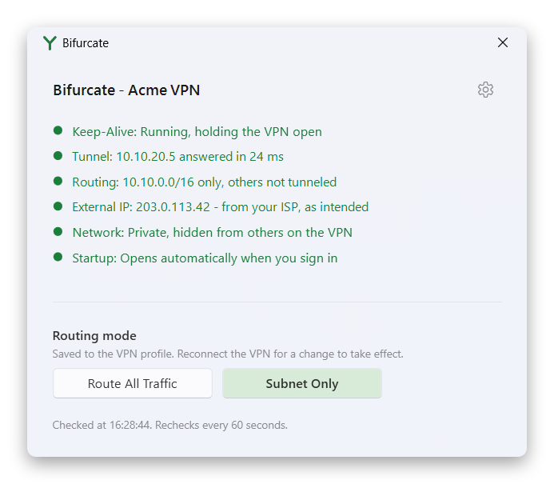
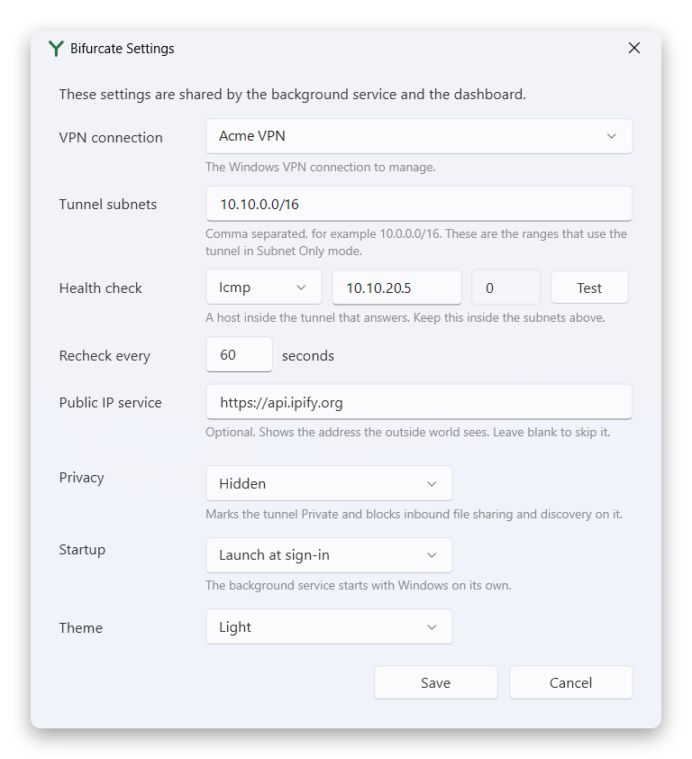

# Bifurcate

[](https://github.com/distantdev/bifurcate/actions/workflows/ci.yml)
[](https://github.com/distantdev/bifurcate/releases/latest)
[](LICENSE)

A VPN privacy and splitting tool for Windows. It does three things:

- **Keeps the tunnel from idling out**, by reaching a host inside it on a schedule.
- **Keeps this PC hidden from other machines on the VPN**, by holding the tunnel's network profile
  Private and blocking inbound file sharing and discovery on the tunnel adapter only.
- **Tells you what is actually happening**, including whether your public traffic is leaking through
  the VPN when you asked for split tunneling, or failing to use it when you asked for full tunneling.

It is not a VPN client. Windows dials the connection; Bifurcate manages what happens around it.



## Install

Download the zip from the releases page, unpack it, and run this from an elevated PowerShell 7
prompt:

```powershell
.\install.ps1
```

Nothing else has to be installed first: the executables are prebuilt and self-contained. They go to
`C:\Program Files\Bifurcate`, a background service is registered to start with Windows, and the tray
app opens. The first run asks which VPN to manage.

The service runs as LocalSystem, because network category and firewall rules are machine-wide, and
the tray app runs as you, because a VPN connection lives in your own phonebook and a service cannot
reach it. That is also why the tray app asks for approval when you save settings and never asks
otherwise.

To uninstall:

```powershell
.\install.ps1 -Uninstall
```

The service removes its own firewall rules on the way out, so nothing is left behind enforcing
anything. Settings and logs stay in `C:\ProgramData\Bifurcate` until you delete them.

## Pointing it at your VPN

Everything specific to your VPN lives in `C:\ProgramData\Bifurcate\config.json`. The settings screen,
behind the gear on the dashboard, writes it for you, and
[config.sample.json](config.sample.json) documents every field.



The two that matter:

- **Tunnel subnets** are the ranges that use the tunnel in Subnet Only mode. If you do not know
  yours, connect the VPN and run `Get-NetRoute -InterfaceAlias <your vpn>` to see what it installs.
- **Health check** has to be a host inside those subnets that answers. Bifurcate warns you if it is
  not, because in Subnet Only mode a host outside them is reached over your ordinary connection, and
  then the keep-alive is not touching the VPN at all. If your network drops ping, switch the check
  from `Icmp` to `Tcp` and give it a port that is open, such as 445 on a file server or 1433 on a
  database.

Saving asks for administrator approval once. That is on purpose: the service acts on these values
machine-wide, so if any user could edit them, any user could have inbound file sharing blocked on an
adapter of their choosing.

## The dashboard

Six lines, rechecked on the interval in your settings and whenever you open the window.

| Line | What it tells you |
|---|---|
| Keep-Alive | Whether the background service is installed and running |
| Tunnel | Whether the health check host answered, and how quickly |
| Routing | Which routing mode is saved, and whether the live session matches it |
| External IP | The address the outside world sees, and whether that path is the one you asked for |
| Network | Whether the tunnel is Private and the inbound blocks are in place |
| Startup | Whether the tray app launches when you sign in |

Green means as intended. Orange usually means **reconnect the VPN**, because Windows only reads a
profile's routing settings when the connection is dialed. Red means something is wrong now.

The tray icon takes the colour of the worst line, and shows a notification when the tunnel stops
answering or public traffic starts leaking through the VPN.

### Routing mode

- **Route All Traffic** sends everything through the VPN.
- **Subnet Only** sends just your tunnel subnets through it and leaves the rest on your own
  connection, which keeps your home bandwidth and your own public address.

Both write to the saved VPN profile and take effect the next time you connect. Neither needs
administrator rights.

### Theme

Light, dark, or whatever Windows is using, from either the settings screen or the tray menu. It is
stored per Windows account under `HKCU\Software\Bifurcate`, so it never needs administrator
approval.

## Troubleshooting

```powershell
& "C:\Program Files\Bifurcate\Bifurcate.Service.exe" --check
```

Prints the config, everything the tool can observe, and the resulting dashboard lines. The service
also writes a log per day to `C:\ProgramData\Bifurcate\logs`, and warnings and errors to the
Application event log under the source `Bifurcate`.

| Symptom | Cause |
|---|---|
| Keep-Alive red, "not installed" | Run `install.ps1` from an elevated prompt |
| Tunnel red while connected | The health check host is not answering. Try a `Tcp` check |
| Routing orange, "reconnect to apply" | The saved mode differs from the live session. Reconnect the VPN |
| External IP red, "leaking past Subnet Only" | Subnet Only is saved, but a default route is on the tunnel. Reconnect |
| Network orange | The inbound rules are missing. The service restores them within a sweep |

## Development

Needs the .NET 10 SDK. `install.ps1` builds from source when sources are there and uses the bundled
executables when they are not, so a clone installs the same way a release does:

```powershell
git clone https://github.com/distantdev/bifurcate C:\Bifurcate
cd C:\Bifurcate
dotnet test
.\install.ps1
```

To watch the service work in the foreground, stop it and run `Bifurcate.Service.exe --console` from
an elevated prompt.

```
src/Bifurcate.Core      All Windows integration and all decision logic
src/Bifurcate.Service   The LocalSystem worker
src/Bifurcate.Tray      WPF tray app, dashboard, and settings
tests/Bifurcate.Tests   Tests for the decision logic
assets/                 The icon embedded in both executables
tools/                  make-icon.ps1, and the two scripts that regenerate the README screenshots
install.ps1             Publish, install, uninstall
```

`Bifurcate.Core` talks to Windows directly rather than hosting PowerShell. The VPN cmdlets are thin
wrappers over CIM classes (`PS_VpnConnection`, `PS_VpnConnectionRoute`), which can be called through
`Microsoft.Management.Infrastructure`, and firewall rules go through the documented `INetFwPolicy2`
COM API. Editing the phonebook file directly is not an option: it stores routes as an opaque binary
blob.

`StatusEvaluator` is a pure function from a state snapshot to the six lines, which is why the exact
wording and colour of every case is covered by tests instead of checked by eye.

## License

MIT. See [LICENSE](LICENSE).
